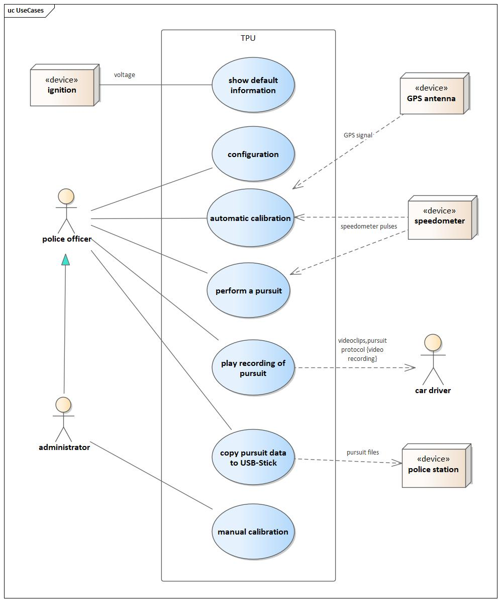
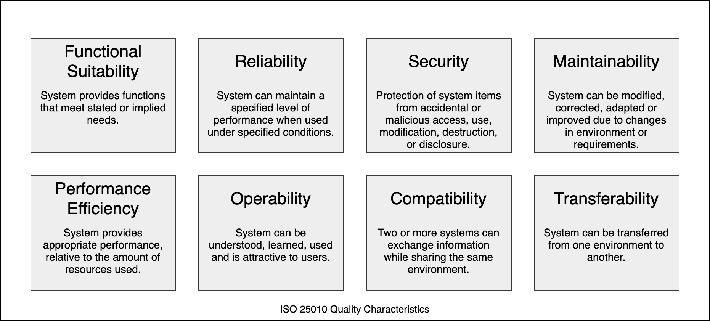

# Introduction and Goals

:construction: TBD

[sample] This document describes the [Traffic Pursuit Unit, short TPU], which is a speed
measuring device equipped with video recording facilities that is installed
within a policecar. It is used to measure and record the speed profile of a car
driving in front of the policecar, so that speed limit violations can be proved
and legal action can be taken based on the documentation and video recordings
produced by the system. The current development is based on an existing version
of the system, that has been developed by the same companies, and shall take
the product to a new release with added and improved features enabled by the
latest developments in hardware technology.

The following goals have been established for this system:

| Priority | Description |
|---|---|
|1|The system shall be enhanced by features that are suitable to keep and strenghten the position as the current market leader|
|2|The system shall implement HD resolution for video clips and storage of the clips to harddisk.|
|3|All system parts that are due to legal approval shall be contained in one unit (called MeasuringUnit), so that replacement of other parts of the system will not require reapproval of the device.|
|4|The MeasuringUnit shall be able to run autonomously and be marketed as a low cost variant of TPU without video proof.|
|5|The operable temperature range shall be expanded to a range of at least -25 to 85 degrees Celsius.|

!!! tldr "Tips for completing this section"
      

      Describes the relevant requirements and the driving forces that software
      architects and development team must consider.

      These include

      * underlying business goals,
      * essential features,
      * essential functional requirements,
      * quality goals for the architecture and
      * relevant stakeholders and their expectations

## Requirements Overview

:construction: TBD

|Id| Requirement|Explanation|
|--|----|-----|
|F1|Perform automatic calibration|perform an automatic calibration by means of GPS information|
|F1.1|Print calibration protocol| |
|F2|Perform a pursuit of a car|follow a car driving at too high speed in order to create a proving documentation|
|F3|Show List of all recorded pursuits| |
|F4|Play recording of a pursuit|replay the video documentation of a pursuit case i.e. to show it to the car driver in charge|
|F5|Print protocol of a pursuit| |
|F6|Show basic information|in idle state the system shall display default information like date and time and the current speed|

!!! tldr "Tips for completing this section"
      **Contents**

      Short description of the functional requirements, driving forces, extract
      (or abstract) of requirements. Link to (hopefully existing) requirements
      documents (with version number and information where to find it).

      **Motivation**

      From the point of view of the end users a system is created or modified
      to improve support of a business activity and/or improve the quality.

      **Form**

      Short textual description, probably in tabular use-case format.

      If requirements documents exist this overview should refer to these documents.

      Keep these excerpts as short as possible. Balance readability of this
      document with potential redundancy w.r.t to requirements documents.

      **Further Information**

      See [Introduction and Goals](https://docs.arc42.org/section-1/) in the
      arc42 documentation.

## Quality Goals

:construction: TBD

!!! tldr "Tips for completing this section"
      **Contents**

      The top three (max five) quality goals for the architecture whose
      fulfillment is of highest importance to the major stakeholders. We really
      mean quality goals for the architecture. Don't confuse them with project
      goals.

      They are not necessarily identical.

      Consider this overview of potential topics (based upon the ISO 25010
      standard):

      

      **Motivation**

      You should know the quality goals of your most important stakeholders,
      since they will influence fundamental architectural decisions. Make sure
      to be very concrete about these qualities, avoid buzzwords. If you as an
      architect do not know how the quality of your work will be judged...

      **Form**

      A table with quality goals and concrete scenarios, ordered by priorities

## Stakeholders

:construction: TBD

!!! tldr "Tips for completing this section"
      **Contents**

      Explicit overview of stakeholders of the system, i.e. all person, roles
      or organizations that

      * should know the architecture
      * have to be convinced of the architecture
      * have to work with the architecture or with code
      * need the documentation of the architecture for their work
      * have to come up with decisions about the system or its development

      **Motivation**

      You should know all parties involved in development of the system or
      affected by the system. Otherwise, you may get nasty surprises later in
      the development process. These stakeholders determine the extent and the
      level of detail of your work and its results.

      **Form**

      Table with role names, person names, and their expectations with respect
      to the architecture and its documentation.

      See [Introduction and Goals](https://docs.arc42.org/section-1/) in the
      arc42 documentation.

| Role/Name | Contact | Expectations |
|---|---|---|
| Role-1 | Contact-1 | Expectation-1 |
| Role-2 | Contact-2 | Expectation-2 |
