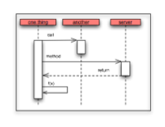

# Runtime View

[TBD]

!!! tldr "Tips for completing this section"
      

      **Contents**

      The runtime view describes concrete behavior and interactions of the
      system’s building blocks in form of scenarios from the following areas:

      * important use cases or features: how do building blocks execute them?
      * interactions at critical external interfaces: how do building blocks
        cooperate with users and neighboring systems?
      * operation and administration: launch, start-up, stop
      * error and exception scenarios

      Remark: The main criterion for the choice of possible scenarios
      (sequences, workflows) is their *architectural relevance*. It is *not*
      important to describe a large number of scenarios. You should rather
      document a representative selection.

      **Motivation**

      You should understand how (instances of) building blocks of your system
      perform their job and communicate at runtime. You will mainly capture
      scenarios in your documentation to communicate your architecture to
      stakeholders that are less willing or able to read and understand the
      static models (building block view, deployment view).

      **Form**

      There are many notations for describing scenarios, e.g.

      * numbered list of steps (in natural language)
      * activity diagrams or flow charts
      * sequence diagrams
      * BPMN or EPCs (event process chains)
      * state machines
      * ...

      **Further Information**

      See [Runtime View](https://docs.arc42.org/section-6/) in the arc42
      documentation.

## [TBD Runtime Scenario 1]

* insert runtime diagram or textual description of the scenario
* insert description of the notable aspects of the interactions between the
  building block instances depicted in this diagram.

## [TBD Runtime Scenario 2]

## ...

## [TBD Runtime Scenario n]
