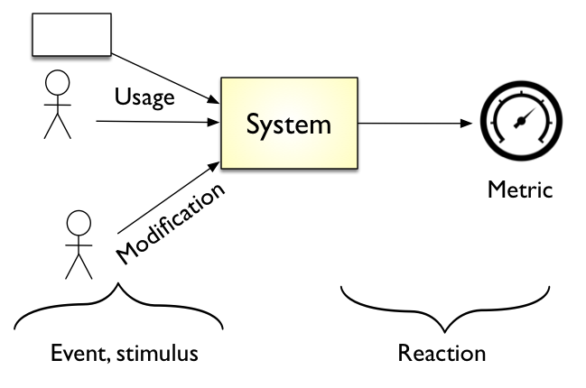

# Quality Requirements

[TBD]

!!! tldr "Tips for completing this section"
      **Contents**

      This section contains all quality requirements as quality tree with
      scenarios. The most important ones have already been described in section
      1.2. (quality goals)

      Here you can also capture quality requirements with lesser priority,
      which will not create high risks when they are not fully achieved.

      **Motivation**

      Since quality requirements will have a lot of influence on architectural
      decisions you should know for every stakeholder what is really important
      to them, concrete and measurable.

      **Further Information**

      See [Quality Requirements](https://docs.arc42.org/section-10/) in the
      arc42 documentation.

## Quality Tree

[TBD]

!!! tldr "Tips for completing this section"
      **Contents**

      The quality tree (as defined in ATAM – Architecture Tradeoff Analysis
      Method) with quality/evaluation scenarios as leafs.

      **Motivation**

      The tree structure with priorities provides an overview for a sometimes
      large number of quality requirements.

      **Form**

      The quality tree is a high-level overview of the quality goals and requirements:

      * tree-like refinement of the term "quality". Use "quality" or
        "usefulness" as a root
      * a mind map with quality categories as main branches

      In any case the tree should include links to the scenarios of the
      following section.

## Quality Scenarios

[TBD]

!!! tldr "Tips for completing this section"
      

      **Contents**

      Concretization of (sometimes vague or implicit) quality requirements
      using (quality) scenarios.

      These scenarios describe what should happen when a stimulus arrives at
      the system.

      For architects, two kinds of scenarios are important:

      * Usage scenarios (also called application scenarios or use case
        scenarios) describe the system’s runtime reaction to a certain
        stimulus. This also includes scenarios that describe the system’s
        efficiency or performance. Example: The system reacts to a user’s
        request within one second.
      * Change scenarios describe a modification of the system or of its
        immediate environment. Example: Additional functionality is implemented
        or requirements for a quality attribute change.

      **Motivation**

      Scenarios make quality requirements concrete and allow to more easily
      measure or decide whether they are fulfilled.

      Especially when you want to assess your architecture using methods like
      ATAM you need to describe your quality goals (from section 1.2) more
      precisely down to a level of scenarios that can be discussed and
      evaluated.

      **Form**

      Tabular or free form text.
